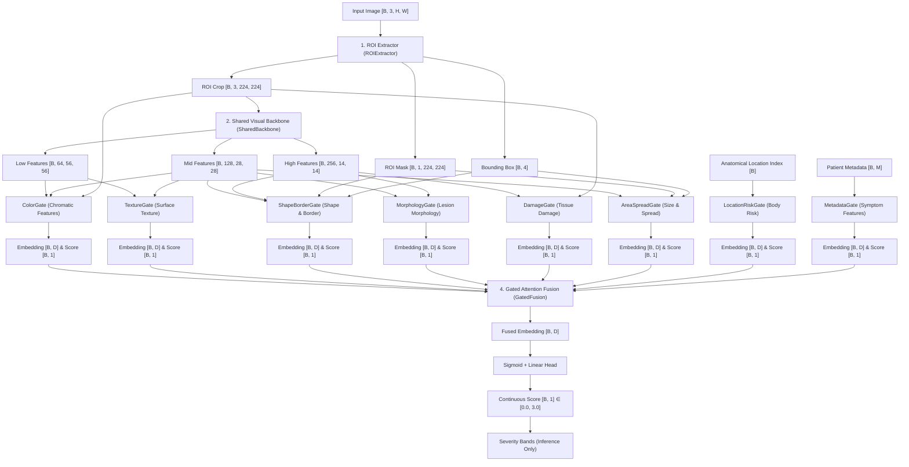

# Modular Gated Neural Pipeline for Continuous Skin Disease Severity Scoring

An end-to-end, clinically-grounded deep learning pipeline designed to assess the severity of dermatological conditions. The architecture uses a modular, multi-gated visual-textual fusion network in PyTorch, outputting a continuous severity score in the range `[0.0, 3.0]`. 

Instead of relying on unstable auxiliary losses, **gate specialization is enforced architecturally** by restricting and routing specific visual, geometric, anatomical, and textual features to designated sub-networks ("gates").

---

## 📖 Table of Contents
1. [Pipeline Architecture Overview](#-pipeline-architecture-overview)
2. [Stage-by-Stage Deep Dive](#-stage-by-stage-deep-dive)
   - [Stage 1: ROI Extraction](#stage-1-roi-extraction)
   - [Stage 2: Multi-Scale Shared Visual Backbone](#stage-2-multi-scale-shared-visual-backbone)
   - [Stage 3: The 8 Specialized Feature Gates](#stage-3-the-8-specialized-feature-gates)
   - [Stage 4: Attention-Based Gated Fusion](#stage-4-attention-based-gated-fusion)
3. [🏥 Clinical Interpretation Bands](#-clinical-interpretation-bands)
4. [🛠️ Robustness & Graceful Degradation](#%EF%B8%8F-robustness--graceful-degradation)
5. [📈 Training Methodology](#-training-methodology)
6. [🚀 Quickstart & Demo Execution](#-quickstart--demo-execution)
7. [📂 File Directory Map](#-file-directory-map)

---

## 🏗️ Pipeline Architecture Overview

The pipeline executes a highly specialized four-stage processing path:
1. **ROI Extraction**: Segments and crops the primary lesion, obtaining a soft lesion mask and normalized bounding box coordinates.
2. **Shared visual Backbone**: Processes the cropped Region of Interest (ROI) to extract low-level, mid-level, and high-level feature maps.
3. **Specialized Feature Gates**: Eight independent gates consume restricted, relevant inputs (visual features, geometric shape stats, anatomical labels, or metadata) to extract targeted clinical cues.
4. **Attention-Based Fusion**: Concatenates all gate outputs, computes sample-dependent dynamic attention weights, fuses the embeddings, and projects them to a continuous clinical severity score.

### System Dataflow Topology



---

## 🔍 Stage-by-Stage Deep Dive

### Stage 1: ROI Extraction
* **Class**: `ROIExtractor` in [roi_extractor.py](file:///d:/OneDrive/Documents/My_Proj/skin_severity/roi_extractor.py)
* **Goal**: Focuses downstream components strictly on the lesion site, filtering out healthy skin, clothing, and background artifacts.
* **Outputs**:
  - `roi_crop` ($[B, 3, 224, 224]$): Bilinearly resized crop of the region of interest.
  - `mask` ($[B, 1, 224, 224]$): A soft $[0, 1]$ segmentor mask. Equipped with a small learnable `saliency_head` (Conv + BatchNorm + Sigmoid) to ensure gradient continuity during pre-production development before hot-plugging a production segmentor.
  - `box_coords` ($[B, 4]$): Bounding box in normalized coordinates $[x_{min}, y_{min}, x_{max}, y_{max}]$.
* **Plug-in Guide**: Easily swap `forward` with real pre-trained segmentation/detection models such as **YOLOv8/v9**, **SAM (Segment Anything)**, or a customized **U-Net**.

---

### Stage 2: Multi-Scale Shared Visual Backbone
* **Class**: `SharedBackbone` in [backbone.py](file:///d:/OneDrive/Documents/My_Proj/skin_severity/backbone.py)
* **Goal**: Extracts multi-scale hierarchical feature maps from the cropped image using lightweight grouped residual blocks, allowing single-GPU training.
* **Feature Levels**:
  - **Low-level** ($[B, 64, 56, 56]$): Captures edges, fine textures, and local color gradients.
  - **Mid-level** ($[B, 128, 28, 28]$): Identifies scaling, roughness, and crusting patterns.
  - **High-level** ($[B, 256, 14, 14]$): Models semantic shape, deep tissue damage, and macro lesion morphology.

---

### Stage 3: The 8 Specialized Feature Gates

Every specialized feature gate inherits from the abstract base class `FeatureGate` ([base_gate.py](file:///d:/OneDrive/Documents/My_Proj/skin_severity/gates/base_gate.py)). Each gate is designed around a unified contract:
1. **Public Interface**: Receives designated inputs, processes them via a sub-class `_gate_forward()`, applies a shared learnable output projection layer (`out_proj`), and computes an internal activation/confidence score via a detached `score_head`.
2. **Unified Embedding Dimensionality**: Projects outputs to a matching dimensionality ($D = 128$) so the attention mechanism can compare heterogeneous features seamlessly.

```python
# The base contract for all Gates
embedding = out_proj(raw_embedding)  # [B, D]
score = score_head(raw_embedding.detach())  # [B, 1] (detached to protect gradients)
```

Below is the clinical and structural overview of the eight gates:

| Gate Name | Inputs Consumed | Clinical Target | Core Structural Mechanism |
| :--- | :--- | :--- | :--- |
| **1. ColorGate** | `roi_image`, `low`, `mid` | Redness, pigmentation changes, yellow crusts, dark/necrosis tones | $1 \times 1$ convolutions (color mixing without spatial bias), hand-crafted global statistics (redness index, saturation, contrast), and Squeeze-and-Excitation channel attention. |
| **2. TextureGate** | `low`, `mid` | Scaling, dryness, flaking, surface roughness | Multi-scale depthwise-separable branches ($3\times3$ and $5\times5$), local spatial attention, and a **Top-K spatial activation selector** which enforces feature sparsity. |
| **3. ShapeBorderGate** | `mid`, `high`, `mask`, `box` | Asymmetry, circularity, border irregularity, jagged/blurred edges | Fixed $3 \times 3$ Sobel filters + learnable edge convolutions, boundary spatial attention (derived from mask or feature energy gradient), and geometric shape descriptors (compactness, aspect ratio). |
| **4. MorphologyGate** | `mid`, `high` | Papules, plaques, nodules, vesicles, pustules | Deep dilated residual blocks (dilation rates: $1, 2, 4$) to capture wider receptive fields without loss of spatial resolution, followed by global average pooling. |
| **5. DamageGate** | `high`, `roi_image` | Ulceration, fissures, bleeding, necrotic wounds | Deeper residual stack, dark-region and red-region spatial cues injected from pixel-level ROI as auxiliary channels, CBAM-style spatial attention, and **Max + Average pooling** to retain localized extreme signals. |
| **6. AreaSpreadGate** | `mid`, `mask`, `box` | Lesion size, affected percentage, spatial dispersion, density | Bounding-box geometry MLP merged with feature-map spatial statistics (spatial entropy proxy, skewness, kurtosis, and median activation). |
| **7. LocationRiskGate**| `location`, `_batch_size` | Clinical risk of specific anatomical sites (e.g. eyes vs. arm) | Learnable index embedding lookup table mapping discrete body sites ($0-20$) to embedding vectors. |
| **8. MetadataGate** | `metadata`, `_batch_size` | Patient symptoms (pain, itching, burning, sleep loss) | Multi-Layer Perceptron (MLP) with Layer Normalization and Dropout projecting numerical/categorical surveys to embeddings. |

---

### Stage 4: Attention-Based Gated Fusion
* **Class**: `GatedFusion` in [fusion.py](file:///d:/OneDrive/Documents/My_Proj/skin_severity/fusion.py)
* **Goal**: Merges the heterogeneous, 128-dimensional representations of the active gates into a single refined representation and predicts the continuous severity score.
* **Mathematical Operations**:
  1. **Concatenation**: Concatenates all gate embeddings into a unified tensor $[B, G \times D]$ (where $G = 8$, $D = 128$).
  2. **Logit Prediction**: Passes the flattened tensor through a two-layer neural net (`attn_net`) with Layer Normalization to output attention logits $[B, G]$.
  3. **Softmax Weighting**: Normalizes the logits using a Softmax layer:
     $$\alpha_i = \frac{e^{\text{logit}_i}}{\sum_{j=1}^G e^{\text{logit}_j}}$$
  4. **Attentive Aggregation**: Computes the weighted sum of all gate embeddings:
     $$\mathbf{z}_{\text{fused}} = \sum_{i=1}^G \alpha_i \mathbf{e}_i \quad \in \mathbb{R}^{D}$$
  5. **Continuous Head Projection**: Projects the refined fused vector through a final feedforward network and applies a scaled Sigmoid layer:
     $$\text{Severity Score} = \text{Sigmoid}(\mathbf{W}_s \mathbf{z}_{\text{fused}} + \mathbf{b}_s) \times 3.0 \quad \in [0.0, 3.0]$$

> [!NOTE]
> Attention weights are dynamic and sample-dependent. For example, if a patient has a small bleeding ulcer, the **DamageGate** attention weight ($\alpha_5$) will scale up automatically. If they present with extensive dry scaling, the **TextureGate** ($\alpha_2$) dominates the prediction score.

---

## 🏥 Clinical Interpretation Bands

Although trained strictly as a regression task, the continuous output score is mapped to five distinct clinical severity bands during evaluation and inference:

| Score Range | Interpretation Band | Clinical Presentation Details |
| :--- | :--- | :--- |
| `[0.0, 0.5)` | **Very Mild** | Minor discoloration or slight texture variation, no swelling/erythema. |
| `[0.5, 1.2)` | **Mild** | Localized redness or minor scaling, small surface area, no tissue damage. |
| `[1.2, 2.0)` | **Moderate** | Clear papules/plaques, moderate border irregularity, high itch/pain metadata. |
| `[2.0, 2.6)` | **Severe** | Dense confluent lesions, significant spreading, minor localized bleeding/erosion. |
| `[2.6, 3.0]` | **Critical / Extreme** | Severe ulceration, necrosis risk, wide spatial spread, critical anatomical locations. |

---

## 🛠️ Robustness & Graceful Degradation

Clinical environments are chaotic: patients leave surveys incomplete, clinicians forget to log locations, and segmentor masks might fail. The pipeline handles missing data gracefully:

1. **Missing Patient Surveys (`metadata` is None or zeroed)**:
   - `MetadataGate` detects empty inputs and returns a zero vector.
   - The fusion network filters this out naturally as it adds nothing to the weighted sum.
2. **Missing Bounding Box or Location Index (`location = -1` or None)**:
   - `LocationRiskGate` routes the input to the zero index (`padding_idx=0`) of the embedding table, which acts as a null-state representation, ensuring the network forward pass does not throw index errors.
3. **Empty Segmentation Mask**:
   - `ShapeBorderGate` detects empty masks (sum $< 1.0$) and dynamically falls back to computing feature-gradient energy maps as a pseudo-boundary, keeping shape/border features active.

---

## 📈 Training Methodology

Unlike standard multi-modal networks that utilize auxiliary losses for each gate, this pipeline enforces gate specialization **architecturally**:
* **Single Final Loss**: The network is trained end-to-end on continuous severity labels utilizing `SmoothL1Loss` (Huber Loss).
* **Controlled Information Paths**: Because gates are restricted to specific inputs (e.g. `TextureGate` cannot see color statistics, and `ColorGate` cannot see spatial texture branches), they are forced to master their own domains to help minimize the global severity loss.
* **Detached Score Heads**: The activation score heads are detached (`raw.detach()`) during the calculation of internal gate confidence metrics, ensuring no secondary gradient conflict arises between local and global heads.

---

## 🚀 Quickstart & Demo Execution

You can demonstrate the training steps, continuous predictions, dynamic gate interpretations, and graceful degradation by running the automated demo script.

### Prerequisites
Make sure PyTorch is installed on your system:
```bash
pip install torch
```

### Run the Demo Script
```bash
python run_demo.py
```

### Expected Output
The console will log the model parameter details, train steps, prediction validation, and show per-gate contribution coefficients ($\alpha_i$) for a dummy batch:

```text
======================================================================
  CONTINUOUS SEVERITY SCORING DEMO
  Score range: [0.0, 3.0]
======================================================================
Device: cuda (or cpu)

Total trainable parameters: 2,752,437

  Severity interpretation bands:
    0.0 - 0.5  ->  very_mild
    0.5 - 1.2  ->  mild
    1.2 - 2.0  ->  moderate
    2.0 - 2.6  ->  severe
    2.6 - 3.0  ->  critical

Forward pass outputs:
  severity_score : torch.Size([4, 1])  ->  [0.34, 1.45, 2.12, 2.87]
  severity_bands : ['very_mild', 'moderate', 'severe', 'critical']
  gate_weights   : torch.Size([4, 8])
  fused_embed    : torch.Size([4, 128])
  explanations   : ['color', 'texture', 'shape_border', 'morphology', 'damage', 'area_spread', 'location_risk', 'metadata']

  gate_weights sum (should be ~1.0): [1.0, 1.0, 1.0, 1.0]

  Per-gate contributions (sample 0, score=0.34):
    color               : 0.1254
    texture             : 0.1143
    shape_border        : 0.1302
    ...
```

---

## 📂 File Directory Map

The codebase is highly modular, making it simple to maintain and update:

```text
My_Proj/
├── run_demo.py                      # Master demo entry point (train loop, validation)
└── skin_severity/                   # Main library package
    ├── __init__.py                  # Exposes top-level classes
    ├── backbone.py                  # Shared multi-scale CNN backbone
    ├── roi_extractor.py             # Lesion detection, segmentation, and cropping
    ├── fusion.py                    # Attention-weighted GatedFusion block
    ├── model.py                     # Main SkinSeverityModel (coordinates everything)
    └── gates/                       # Directory containing specialized gates
        ├── __init__.py              # Exposes all gates
        ├── base_gate.py             # Abstract base FeatureGate contract
        ├── color_gate.py            # Extracts chromatic/color statistics
        ├── texture_gate.py          # Extracts roughness and surface scaling details
        ├── shape_border_gate.py     # Detects border irregularity & aspect ratio
        ├── morphology_gate.py       # Identifies lesions structures via dilated Convs
        ├── damage_gate.py           # Detects ulceration, fissures, and necrosis
        ├── area_spread_gate.py      # Measures overall size and dispersion stats
        ├── location_risk_gate.py    # Embeds discrete anatomical risk metrics
        └── metadata_gate.py         # Transforms patient surveys to embeddings
```
